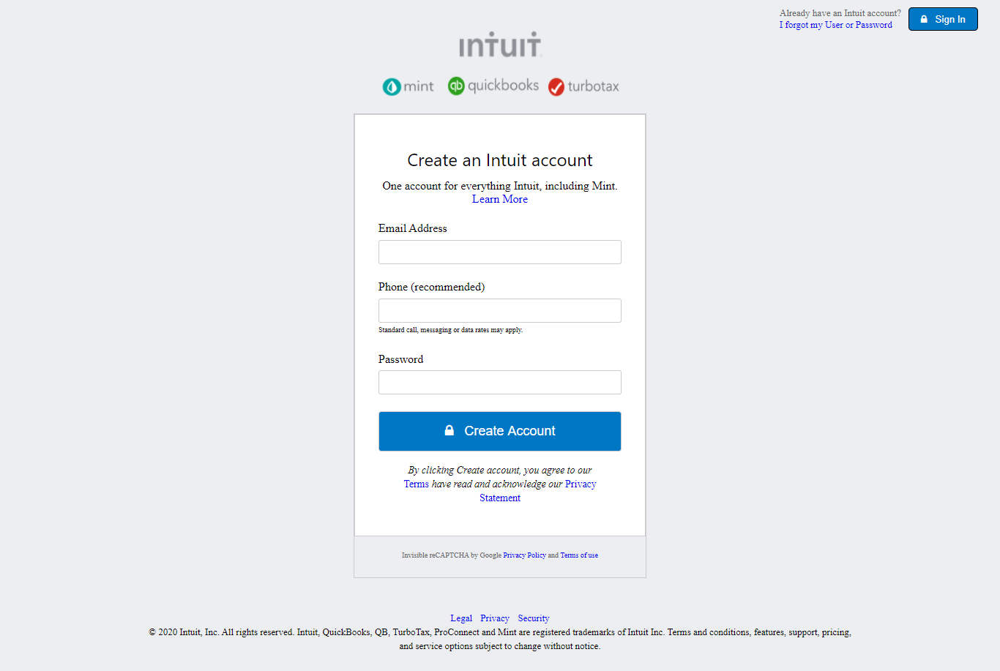

# MINT SIGN UP PAGE
This is a form data collection project where we cloned a sign up page using HTML5 and CSS3 only.

## The following are some the features of this project:

1. Has input fields for email, phone number and password
2. Has sign-up button
3. Has sign-in button
4. Has a link taking you to the forgot my user ID and password page
5. Has different links for privacy policy, privacy statement and terms of use
6. Has a footer with different links for legal, security and privacy.

## Built With

- HTML5
- CSS3

## Getting Started 

For one to get started, just clone the repository and open index.html file in your browser.

## Authors

 **Uchenna Martins Anya**

- Github: [uchennaanya](https://github.com/uchennaanya)
- Twitter:[@matinsanya19](https://twitter.com/martinsanya19)
- Linkedin: [Uchenna Martin Anya](https://www.linkedin.com/in/uchenna-anya/)

**Iris Enaelle Kineza** 

- Github: [KinezaEnaelle](https://github.com/KinezaEnaelle)
- Twitter: [@IKineza](https://twitter.com/ikineza)
- Linkedin: [Iris Enaelle Kineza](https://www.linkedin.com/in/iris-enaelle-kineza-25a676187/)

## Contributions

Faeture requests and issues are most welcome.

## Live Demo 

https://rawcdn.githack.com/KinezaEnaelle/Mint-Signup/a945d8e625863ffe14e6a76fa53725a5b92dc06a/index.html

## Show your support

Give a ⭐️ if you like this project.

## License

This project is [MIT](https://github.com/KinezaEnaelle/Mint-Signup/blob/master/LICENSE) licensed.
